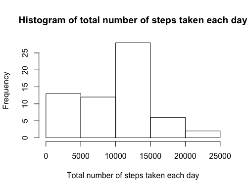
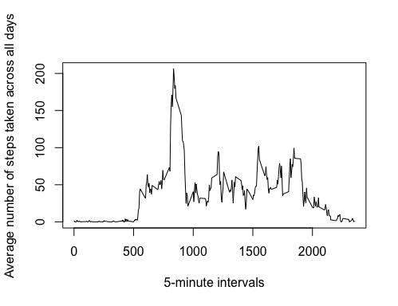
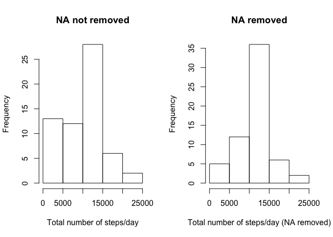
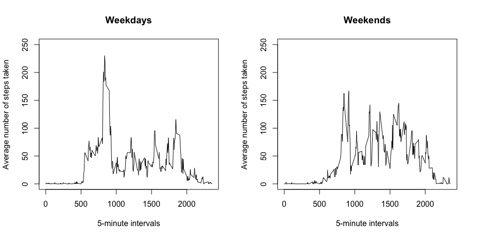

This assignment makes use of data from a personal activity monitoring device. This device collects data at 5 minute intervals through out the day. The data consists of two months of data from an anonymous individual collected during the months of October and November, 2012 and include the number of steps taken in 5 minute intervals each day.

**Note**: This assignment uses the `dplyr` packages (and its dependencies).

```r
library(dplyr, warn.conflicts = FALSE)
```

## Data

The data for this assignment can be downloaded from the course web site:  

+ Dataset: [Activity monitoring data](https://d396qusza40orc.cloudfront.net/repdata%2Fdata%2Factivity.zip)  

The variables included in this dataset are:  

- **steps**: Number of steps taking in a 5-minute interval (missing values are coded as `NA`)
- **date**: The date on which the measurement was taken in YYYY-MM-DD format
- **interval**: Identifier for the 5-minute interval in which measurement was taken

## Assignments

The assignment will be described in multiple parts. This is a report that answers the questions detailed below.

### Loading and preprocessing the data

1. Load the data

```r
data <- tbl_df(read.csv("activity.csv"))
```

2. Process/transform the data (if necessary) into a format suitable for analysis

```r
data$date <- as.Date(as.character(data$date))
data$interval <- as.character(data$interval)
```

### What is mean total number of steps taken per day?
For this part of the assignment, the missing values in the dataset are ignored.

1. Make a histogram of the total number of steps taken each day


```r
stepsEachDay <- data %>%
    group_by(date) %>%
    summarize(sum = sum(steps, na.rm = TRUE))
hist(stepsEachDay$sum,
     xlab = "Total number of steps taken each day",
     main = "Histogram of total number of steps taken each day")
```

<!-- -->

2. Calculate and report the **mean** and **median** total number of steps taken per day


```r
mean(stepsEachDay$sum)
```

```
## [1] 9354.23
```

```r
median(stepsEachDay$sum)
```

```
## [1] 10395
```

### What is the average daily activity pattern?

1. Make a time series plot (i.e. `type = "l"`) of the 5-minute interval (x-axis) and the average number of steps taken, averaged across all days (y-axis)


```r
pattern <- data %>%
    group_by(interval) %>%
    summarize(avg = mean(steps, na.rm = TRUE))
pattern <- pattern[order(nchar(pattern$interval), pattern$interval),]
plot(pattern$interval, pattern$avg, type = "l",
     xlab = "5-minute intervals",
     ylab = "Average number of steps taken across all days")
```

<!-- -->

2. Which 5-minute interval, on average across all the days in the dataset, contains the maximum number of steps?


```r
pattern$interval[pattern$avg == max(pattern$avg)]
```

```
## [1] "835"
```

### Imputing missing values

Note that there are a number of days/intervals where there are missing values (coded as `NA`). The presence of missing days may introduce bias into some calculations or summaries of the data.

1. Calculate and report the total number of missing values in the dataset (i.e. the total number of rows with `NA`s)


```r
nrow(data) - sum(complete.cases(data))
```

```
## [1] 2304
```

2. Devise a strategy for filling in all of the missing values in the dataset. In this problem, we use the the **mean** for that **5-minute interval**.
3. Create a new dataset that is equal to the original dataset but with the missing data filled in.


```r
data_narm <- data
for (i in 1:nrow(data_narm)) {
    if (is.na(data_narm[i,1]))
        data_narm[i,"steps"] <- pattern$avg[pattern$interval == as.character(data_narm[i,"interval"])]
}
```

4. Make a histogram of the total number of steps taken each day. Then calculate and report the **mean** and **median** total number of steps taken per day. Do these values differ from the estimates from the first part of the assignment? What is the impact of imputing missing data on the estimates of the total daily number of steps?


```r
stepsEachDay_narm <- data_narm %>%
    group_by(date) %>%
    summarize(sum = sum(steps))
par(mfrow = c(1,2))
hist(stepsEachDay$sum,
     xlab = "Total number of steps/day",
     main = "NA not removed")
hist(stepsEachDay_narm$sum,
     xlab = "Total number of steps/day (NA removed)",
     main = "NA removed")
```

<!-- -->

```r
mean_na <- mean(stepsEachDay$sum)
mean_narm <- mean(stepsEachDay_narm$sum)
median_na <- median(stepsEachDay$sum)
median_narm <- median(stepsEachDay_narm$sum)
```


+ The mean total number of steps taken per day **before** removing `NA` values: 9354.2295082.  
+ The mean total number of steps taken per day **after** removing `NA` values: 1.07662\times 10^{4}.  
+ The median total number of steps taken per day **before** removing `NA` values: 10395.  
+ The median total number of steps taken per day **after** removing `NA` values: 1.07662\times 10^{4}.  

We can see that the values differ after removing `NA` values. Both the mean and the median increased, possibly because the values substituted for `NA`s are from time intervals with relatively large number of mean steps.

### Are there differences in activity patterns between weekdays and weekends?

The dataset with the filled-in missing values is used for this part.

1. Create a new factor variable in the dataset with two levels -- "weekday" and "weekend" indicating whether a given date is a weekday or weekend day.


```r
isWeekend <- weekdays(data_narm$date, abbreviate = TRUE)
for (x in 1:length(isWeekend)){
    if (isWeekend[x] %in% c("Mon", "Tue", "Wed", "Thu", "Fri")) isWeekend[x] <- "weekday"
    else isWeekend[x] <- "weekend"
}
data_narm <- mutate(data_narm, isweekend = as.factor(isWeekend))
```

2. Make a panel plot containing a time series plot (i.e. `type = "l"`) of the 5-minute interval (x-axis) and the average number of steps taken, averaged across all weekday days or weekend days (y-axis).


```r
datasplit <- split(data_narm, data_narm$isweekend)
patweekday <- datasplit[[1]] %>%
    group_by(interval) %>%
    summarize(avg = mean(steps))
patweekend <- datasplit[[2]] %>%
    group_by(interval) %>%
    summarize(avg = mean(steps))
patweekday <- patweekday[order(nchar(patweekday$interval), patweekday$interval),]
patweekend <- patweekend[order(nchar(patweekend$interval), patweekend$interval),]

par(mfrow = c(1,2))
plot(patweekday$interval, patweekday$avg, type = "l",
     main = "Weekdays",
     xlab = "5-minute intervals",
     ylab = "Average number of steps taken",
     ylim = c(0,250))
plot(patweekend$interval, patweekend$avg, type = "l",
     main = "Weekends",
     xlab = "5-minute intervals",
     ylab = "Average number of steps taken",
     ylim = c(0,250))
```

<!-- -->
